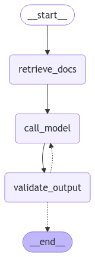

## Introduction

In this tutorial, you'll learn how to build an LLM-powered app step by step that assists in accessing biodata available at the SIB by doing retrieval augmented generation (RAG):

- Recommend the relevant SIB resources and tools
- Write SPARQL queries to retrieve data from SIB public endpoints

As we progress, you'll be provided with code snippets to gradually construct the system. Note that some earlier code may need to be modified or removed to prevent redundancy, ensuring a clean and efficient implementation.

---

## Outline

1. Standards and libraries
2. Programmatically query LLMs
3. Add context to find the right resource
4. Build a search index to find the right context
5. Write a custom loader for CSV file
6. Extend search index to help writing SPARQL queries
7. Add a step to extract information to improve search
8. Add a web UI (optional but cool)

---

## Standards and protocols

- **[OpenAI-compatible APIs](https://platform.openai.com/docs/api-reference/introduction)**
  - Original API defined by OpenAI to serve LLMs
  - Became an unofficial standard replicated by many providers
- **Anthropic [Model Context Protocol](https://modelcontextprotocol.io)**
  - Recent open protocol that standardizes how applications provide context to LLMs
  - Helps LLMs access resources and tools
  - Limited [support](https://modelcontextprotocol.io/clients): Claude Desktop, and partially by some IDEs

Common features supported by most providers:

- Streaming response
- Structured output
  - force the LLM to answer in a structured format (e.g. JSON)
- Tool calling
  - provide a list of tools the LLM can use

---

## Agent libraries

Libraries to help building workflows that use LLMs

- [LangChain/LangGraph](https://www.langchain.com/)
  - Complete “agent” framework with integrations for most LLM utilities (providers, search indexes…)
- [LlamaIndex](https://www.llamaindex.ai/)
  - Quite similar to LangChain
- [smolagents](https://huggingface.co/docs/smolagents/index) by HuggingFace
  - Introduces code-based tool calling
- [pydantic-ai](https://ai.pydantic.dev/)
  - Agent Framework to use Pydantic with LLMs, focusing on structured output
- [AutoGen](https://github.com/microsoft/autogen) by microsoft
- [Strands](https://strandsagents.com/0.1.x/) by AWS
- And more…

> ⚠️ Those libraries can evolve quickly

---

## UI libraries

🐍 For Python

- [ChainLit](https://chainlit.io/) - Build specifically for chat interface
- [StreamLit](https://docs.streamlit.io/develop/api-reference/chat) - General python based UI with chat components
- [Gradio](https://www.gradio.app/) - HuggingFace
- [Mesop](https://mesop-dev.github.io/mesop/) - Google

🟨 For JavaScript/TypeScript

- [Vercel `ai`](https://sdk.vercel.ai/docs/introduction) NPM package
- [assistant-ui](https://www.assistant-ui.com/)

---

## API key to a LLM provider

A few LLM providers are currently providing a **free tier** that is good enough for a single person use.

- [🇪🇺 Mistral.ai](https://console.mistral.ai/upgrade/details) - 1 req/sec, 500k tokens/min, 1B tokens/months
- [Google](https://ai.google.dev/gemini-api/docs/rate-limits) - 250k tokens/min, 500 req/day (depends on model)
- [Groq](https://groq.com/pricing/) - Meta open source models, only 6k tokens/min

> ⚠️ Everything send to these providers will be used to further train their model. These offerings might change in the future.

---

## Setup

[Install `uv`](https://docs.astral.sh/uv/getting-started/installation/) to easily handle dependencies and run scripts.

If you use VSCode we recommend to have the [`Python` extension](https://marketplace.visualstudio.com/items?itemName=ms-python.python) installed.

Create a new folder, you will be using this same folder along the tutorial.

Create a `.env` file with the API key for the LLM provider you will use:

```sh
MISTRAL_API_KEY=YYY
```

> 💡 Create a `README.md` to put there the commands you will use

----

## Using Google Gemini

Get your API key from https://aistudio.google.com/app/apikey

In the `.env` file define `GOOGLE_API_KEY=YYY`

Add the following dependency in the `pyproject.toml` at the next step:

```toml
    "langchain-google-genai >=2.1.4",
```

---

## Setup dependencies

Create a `pyproject.toml` file with this content:

```toml
[project]
name = "llm-biodata-training"
version = "0.0.1"
requires-python = "==3.12.*"
dependencies = [
    "httpx >=0.28.1",
    "pandas >=2.2.3",
    "sparql-llm >=0.0.8",
    "langchain >=0.3.25",
    "langchain-community >=0.3.24",
    "langchain-mistralai >=0.2.10",
    "langchain-ollama >=0.3.2",
    "qdrant-client >=1.14.2",
    "fastembed >=0.7.0",
    "chainlit >=2.5.5",
]
```

> ⚠️ If you cannot run python/uv locally check the slide below

----

## Use a notebook

Alternatively you can use [Google Colab notebooks](https://colab.research.google.com).

It is not ideal for building a chat interface, but will do the job to query a LLM programmatically.

Install the required dependencies in the notebook:

```sh
!pip install httpx pandas sparql-llm langchain langchain-community langchain-mistralai langchain-ollama qdrant-client fastembed
```

And define your provider API key as secret (the key icon 🔑 in the menu on the left)

e.g. `MISTRAL_API_KEY`

You can then use it with:

```python
from google.colab import userdata
from langchain_mistralai import ChatMistralAI

llm = ChatMistralAI(
    model="mistral-large-latest",
    api_key=userdata.get('MISTRAL_API_KEY'),
)
```

---

## Programmatically query a LLM

Create a `app.py` file in the same folder

```python
from langchain_mistralai import ChatMistralAI

llm = ChatMistralAI(
    model="mistral-large-latest",  # switch to small in case of quota limitations
    # model="mistral-medium-2505", # smaller model mainly for development
    temperature=0,  # 0 for deterministic output
    max_retries=2,  # number of retries in case of error
    random_seed=42, # random seed for reproducibilit
)

resp = llm.invoke("Which tools can I use for comparative genomics?")
print(resp)
```

Run it with:

```sh
uv run --env-file .env app.py
```

---

## Programmatically query various LLMs

Let's make a function to easily switch the model used

```python
from langchain_core.language_models import BaseChatModel

def load_chat_model(model: str) -> BaseChatModel:
    provider, model_name = model.split("/", maxsplit=1)
    if provider == "mistral":
      	# https://python.langchain.com/docs/integrations/chat/mistralai/
        from langchain_mistralai import ChatMistralAI
        return ChatMistralAI(
            model=model_name,
            temperature=0,
            max_retries=2,
            random_seed=42,
        )
    if provider == "google":
      	# https://python.langchain.com/docs/integrations/chat/google_generative_ai/
      	from langchain_google_genai import ChatGoogleGenerativeAI
        return ChatGoogleGenerativeAI(model=model_name, temperature=0)
    raise ValueError(f"Unknown provider: {provider}")

llm = load_chat_model("mistral/mistral-large-latest")
# llm = load_chat_model("google/gemini-2.0-flash")
```

> ℹ️ Alternatively you could replace LangChain by [LiteLLM](https://docs.litellm.ai/docs/) here to use many providers with a unified API.

---

## Stream a LLM response

Instead of waiting for the complete LLM response we can stream it token per token, and print token usage at the end	

```python
def ask(question: str) -> None:
    for resp in llm.stream(question):
        print(resp.content, end="")
        if resp.usage_metadata:
            print(f"\n\n{resp.usage_metadata}")
            
ask("Which tools can I use  for comparative genomics?")
```

---

## Use a local LLM (optional)

Install ollama: [ollama.com/download](https://www.ollama.com/download)

Pull the [model](https://www.ollama.com/search) you want to use (⚠️ lots of GB to download):

```sh
ollama pull mistral   # 4 GB
ollama pull qwen3:32b # 20 GB
```

Add the new provider:

```python
    if provider == "ollama":
        # https://python.langchain.com/docs/integrations/chat/ollama/
        from langchain_ollama import ChatOllama
        return ChatOllama(model=model_name, temperature=0)

llm = load_chat_model("ollama/mistral")
```

> 🦙 Ollama is mainly a wrapper around [llama.cpp](https://python.langchain.com/docs/integrations/chat/llamacpp/), you can also [download `.gguf` files](https://huggingface.co/lmstudio-community/Mistral-7B-Instruct-v0.3-GGUF) and use them directly.

> 👥 [vLLM](https://github.com/vllm-project/vllm) is a better solution if you need to deploy a LLM provider for multiple users.

---

## Add context from a CSV file

We will use [this CSV file](https://github.com/sib-swiss/sparql-llm/blob/main/src/expasy-agent/expasy_resources_metadata.csv) containing informations about SIB resources.

```python
import httpx

SYSTEM_PROMPT = """You are an assistant that helps users to navigate the resources and databases from the SIB Swiss Institute of Bioinformatics.
Here is the description of resources available at the SIB:
{context}
Use it to answer the question"""

response = httpx.get("https://github.com/sib-swiss/sparql-llm/raw/refs/heads/main/src/expasy-agent/expasy_resources_metadata.csv", follow_redirects=True)

def ask(question: str) -> str:
    messages = [
        ("system", SYSTEM_PROMPT.format(context=response.text)),
        ("human", question),
    ]
    for resp in llm.stream(messages):
        print(resp.content, end="")
        if resp.usage_metadata:
            print(f"\n\n{resp.usage_metadata}")

ask("Which tools can I use for comparative genomics?")
```

> ⚠️ Checkout the amount of used tokens: this approach uses a lot of them!

> 💡 You can do this directly through most LLM provider web UI: upload a file and ask a question!

---

## Index relevant information

A solution to handle large context is to build a **semantic search index**, and only retrieve the documents or part of documents that are relevant to the question.

It also brings explainability of how the response was generated, reducing the black box effect.

When preparing data for semantic search, focus on two essential components:

- **Semantic label**: a short, human-readable title or description that guides the search engine in matching questions effectively.
- **Detailed information**: the set of metadata or full content of the data element, which will be passed to the LLM and used to generate informed responses.

> 💡 While you can use the same text for both parts, complex data often benefits from a clear, concise semantic label(s) paired with a richer, detailed description for the LLM.

---

## Index CSV file with generic loader

Create an `index.py` file in the same folder, to separate the indexing from the inference

Let's split the CSV in a list of documents (1 row per doc)

```python
import httpx
from langchain_core.documents import Document
from langchain_community.document_loaders import CSVLoader

def load_resources_csv(url: str) -> list[Document]:
    """Load resources from a CSV file and return a list of Document objects."""
    resp = httpx.get(url, follow_redirects=True)
    with open("tmp.csv", "w") as f:
        f.write(resp.text)
    docs = CSVLoader(file_path="tmp.csv", csv_args={"delimiter": ","}).load()
    # Add page_content to metadata because we directly use the search engine lib instead of LangChain retriever abstraction
    for doc in docs:
        doc.metadata["description"] = doc.page_content
    return docs

if __name__ == "__main__":
    docs = load_resources_csv("https://github.com/sib-swiss/sparql-llm/raw/refs/heads/main/src/expasy-agent/expasy_resources_metadata.csv")
    print(docs[0])
```

🚀  Run with:

```sh
uv run index.py
```

---

## Index loaded documents

Instantiate the **[Qdrant](https://qdrant.tech/documentation/)** vector database (aka. semantic search engine).

We use **[FastEmbed](https://qdrant.github.io/fastembed/)** to generate embeddings (aka. vectors) locally with [open source embedding models](https://qdrant.github.io/fastembed/examples/Supported_Models/#supported-text-embedding-models).

```python
from fastembed import TextEmbedding
from qdrant_client import QdrantClient

embedding_model = TextEmbedding(
    "BAAI/bge-small-en-v1.5",
    # providers=["CUDAExecutionProvider"], # To use GPUs, replace the fastembed dependency with fastembed-gpu
)
embedding_dimensions = 384 # Check the list of models to find a model dimensions
collection_name = "sib-biodata"
vectordb = QdrantClient(path="data/vectordb")
# [...]
```

---

## Index loaded documents

Generate embeddings and upload them in the vector database

```python
from qdrant_client.http.models import Distance, VectorParams

if __name__ == "__main__":
    # [...]
    if vectordb.collection_exists(collection_name):
        vectordb.delete_collection(collection_name)
    # Create the collection of embeddings
    vectordb.create_collection(
        collection_name=collection_name,
        vectors_config=VectorParams(size=embedding_dimensions, distance=Distance.COSINE),
    )
    # Generate embeddings for each document
    embeddings = embedding_model.embed([q.page_content for q in docs])
    # Upload the embeddings in the collection
    vectordb.upload_collection(
        collection_name=collection_name,
        vectors=[embed.tolist() for embed in embeddings],
        payload=[doc.metadata for doc in docs],
    )
```

> 🚀 Run `index.py`

---

## Use index to provide specific context to the LLM

Now we can go back to our `app.py` file.

And retrieve documents related to the user question using the vector store

```python
from index import vectordb, embedding_model, collection_name

def ask(question: str) -> str:
    # Generate embeddings for the user question
    question_embeddings = next(iter(embedding_model.embed([question])))
    # Find similar embeddings in the vector database
    retrieved_docs = vectordb.query_points(
        collection_name=collection_name,
        query=question_embeddings,
        limit=10,
    )
    print(f"📚️ Retrieved {len(retrieved_docs.points)} documents")
    formatted_docs = '\n'.join(doc.payload["description"] for doc in retrieved_docs.points)
    messages = [
        ("system", SYSTEM_PROMPT.format(context=formatted_docs)),
        ("human", question),
    ]
    # [...]
```

> 🚀 Run `app.py`

---

## Write a custom CSV loader (optimization)

For more accurate query matching, we can write a custom loader for our specific CSV file.

Return to `index.py` file.

```python
import pandas as pd

def load_resources_csv(url: str) -> list[Document]:
    """Load resources from a CSV file and return a list of Document objects."""
    df = pd.read_csv(url)
    docs: list[Document] = []
    for _, row in df.iterrows():
        description = f"[{row['title']}]({row['url']}) ({row['category']}): {row['description']}"
        page_content = f"{row['title']} {row['description']}"
        # Long description of the resource
        doc = Document(
            page_content=page_content,
            metadata={
                "iri": row["url"],
              	"page_content": page_content,
                "description": description,
                "doc_type": "General information",
            }
        )
        docs.append(doc)
        # Ontology terms
        if row.get("ontology_terms"):
            page_content = f"{row['ontology_terms']}"
            doc = Document(
                page_content=page_content,
                metadata={
                    "iri": row["url"],
                  	"page_content": page_content,
                    "description": description,
                    "doc_type": "General information",
                }
            )
            docs.append(doc)
    print(f"✅ {len(docs)} documents indexed from {url}")
    return docs
```

> 🚀 Run `index.py`, then `app.py`

---

## 🧐 Explore the CSV file with your customized LLM!

Ask different questions using the `ask()` function, for example:

- Which is the best SIB tool for comparative genomics?
- Which resources should I use to study the evolution of a protein?

---

## Query the SIB knowledge graphs with [SPARQL](https://en.wikipedia.org/wiki/SPARQL)

A standard language to query publicly available knowledge graphs.

Similar to SQL, but for data structured as nodes and edges.

Here we retrieve the list of species with their common and scientific name from [UniProt](https://sparql.uniprot.org/sparql/):

```sql
#+ endpoint: https://sparql.uniprot.org/sparql/
PREFIX up: <http://purl.uniprot.org/core/>

SELECT DISTINCT * WHERE {
    ?taxon a up:Taxon ;
        up:commonName ?commonName ;
        up:scientificName ?scientificName .
} LIMIT 20
```

You can easily execute SPARQL queries on endpoints here: [sib-swiss.github.io/sparql-editor](https://sib-swiss.github.io/sparql-editor/)

> 😌 You will not learn to write SPARQL queries here, but to get the LLM to write them for you.

---

## Index SPARQL endpoints context

Use the loaders from the **[`sparql-llm`](https://pypi.org/project/sparql-llm/)** package to easily extract and load documents describing the endpoints (query examples and classes schemas) in the **`index.py`** file

```python
from langchain_core.documents import Document
from sparql_llm import SparqlExamplesLoader, SparqlVoidShapesLoader

def load_sparql_endpoints() -> list[Document]:
    endpoints: list[str] = [
        "https://sparql.uniprot.org/sparql/",
        "https://www.bgee.org/sparql/",
        "https://sparql.omabrowser.org/sparql/",
        "https://sparql.rhea-db.org/sparql/",
    ]
    docs: list[Document] = []
    for endpoint in endpoints:
        print(f"\n  🔎 Getting metadata for {endpoint}")
        docs += SparqlExamplesLoader(endpoint).load()
        docs += SparqlVoidShapesLoader(endpoint).load()
    print(f"✅ {len(docs)} documents indexed from {len(endpoints)} endpoints")
    return docs

if __name__ == "__main__":
    # [...]
    docs += load_sparql_endpoints()
    # [...]
```

> 🚀 Run `index.py`

---

## Adapt the prompt

To provide better instructions on how to generate SPARQL queries

```python
SYSTEM_PROMPT = """You are an assistant that helps users to navigate the resources and databases from the SIB Swiss Institute of Bioinformatics.

Depending on the user question and provided context, you may provide general information about the resources available at the SIB, or help the user to formulate a query to run on a SPARQL endpoint.

If answering with a SPARQL query:
Put the query inside a markdown codeblock with the `sparql` language tag, and always add the URL of the endpoint on which the query should be executed in a comment at the start of the query inside the codeblocks starting with "#+ endpoint: " (always only 1 endpoint).
Always answer with one query, if the answer lies in different endpoints, provide a federated query.
And briefly explain the query.

Here is a list of documents relevant to the user question that will help you answer the user question accurately:
{context}"""
```

---

## Adapt the document formatting

Adapt the code formatting the retrieved docs to work with the payload returned by the SPARQL loaders

```python
def ask(question: str):
    # [...]
    formatted_docs = ""
    for doc in retrieved_docs.points:
        if doc.payload.get("description"):
            formatted_docs += f"\n{doc.payload['description']}"
        else:
            formatted_docs += f"\n{doc.payload.get('question')}:\n\n```sparql\n#+ endpoint: {doc.payload.get('endpoint_url')}\n{doc.payload.get('answer')}\n```\n"
    messages = [
        ("system", SYSTEM_PROMPT.format(context=formatted_docs)),
        ("human", question),
    ]
    # [...]

ask("What is the HGNC symbol for the protein P68871?")
```

> 🚀 Run `app.py`

---

## Ask some questions

- Where is the ACE2 gene expressed in humans?
- What are the rat orthologs of the human TP53 gene?

---

## Answer with a structured output

This enables to constraint the LLM to answer with a structured output

Enables to fine-tune the request made to the search engine and reformulate the question for more efficient similarity search.

Let's first create the schema of the dictionary returned by the LLM in this step

```python
from typing import Annotated, TypedDict, Literal

EXTRACT_PROMPT = """Given a user question:
- Extract the intent of the question: either "sparql_query" (query available resources to answer biomedical questions), or "general_informations" (tools available, infos about the resources)
- Reformulate the question to make it more straigthforward and adapted to running a semantic similarity search"""

class ExtractedQuestion(TypedDict):
    intent: Annotated[Literal["general_information", "sparql_query"], "Intent extracted from the user question"]
    reformulated: Annotated[str, "Reformulated question adapted to semantic similarity search"]

# Constraint the LLM to answer with the wanted structure
structured_llm = llm.with_structured_output(ExtractedQuestion)
# [...]
```

---

## Answer with a structured output

Then update the `ask` function to add the extraction step, and use its output during documents retrieval

```python
from qdrant_client.models import FieldCondition, Filter, MatchValue

def ask(question: str) -> str:
    extracted: ExtractedQuestion = structured_llm.invoke([
        ("system", EXTRACT_PROMPT),
        ("user", question),
    ])
    print(extracted)
    if extracted["intent"] == "general_information":
        query_filter = Filter(must=[FieldCondition(
            key="doc_type",
            match=MatchValue(value="General information"),
        )])
    else:
        query_filter = Filter(must_not=[FieldCondition(
            key="doc_type",
            match=MatchValue(value="General information"),
        )])
    # Use reformulated question when querying the vectordb
    question_embeddings = next(iter(embedding_model.embed([extracted["reformulated"]])))
    # Add query filters
    retrieved_docs = vectordb.query_points(
        collection_name=collection_name,
        query=question_embeddings,
        query_filter=query_filter,
        limit=10,
    )
    # [...]
```

> 🚀 Run `app.py`

---

## Deploy with a nice web UI

Using [Chainlit](https://chainlit.io/), replace the `ask` function with this `on_message` decorated function:

```python
import time
import chainlit as cl

@cl.on_message
async def on_message(msg: cl.Message):
    """Main function to handle when user send a message to the assistant."""
    extracted: ExtractedQuestion = structured_llm.invoke([
        ("system", EXTRACT_PROMPT),
        *cl.chat_context.to_openai(), # Pass the whole chat history
    ])
    time.sleep(1) # To avoid quota limitations
    # [...]
    answer = cl.Message(content="")
    for resp in llm.stream([
        ("system", SYSTEM_PROMPT.format(context=formatted_docs)),
        *cl.chat_context.to_openai(),
    ]):
        await answer.stream_token(resp.content)
        if resp.usage_metadata:
            print(resp.usage_metadata)
    await answer.send()
```

🚀 Deploy the UI on [localhost:8000](http://localhost:8000) with:

```sh
uv run chainlit run app.py
```

---

## Deploy with a nice web UI

Add steps to see the results of part of your workflow

```python
@cl.on_message
async def on_message(msg: cl.Message):
    # [...]
    async with cl.Step(name="extracted ⚗️") as step:
        step.output = extracted
    # [...]
    async with cl.Step(name=f"{len(retrieved_docs.points)} relevant documents 📚️") as step:
        step.output = formatted_docs
    # [...]
```

---

## Deploy with a nice web UI

You can add some example questions

```python
@cl.set_starters
async def set_starters():
    return [
        cl.Starter(
            label="Tools for comparative genomics",
            message="Which tools can I use for comparative genomics?",
        ),
        cl.Starter(
            label="HGNC symbol for P68871",
            message="What is the HGNC symbol for the P68871 protein?",
        ),
    ]
```

---

## Customize the UI

Enable the user to [change settings](https://docs.chainlit.io/api-reference/chat-settings) like temperature, or provide their own API key

[Visual customization](https://docs.chainlit.io/customisation/overview)

- Change general settings in `.chainlit/config.toml`
  - e.g. set `custom_css= "/public/style.css"` containing: `pre { padding: .5em; } a.watermark { display: none !important; }`

- Add your logo in the `public` folder:
  - `logo_dark.png`, `logo_light.png`, `favicon`

---

## Use an agent framework (optional)

Optionally you can move to fully use an "agent framework" like [LangGraph](https://langchain-ai.github.io/langgraph/#), LlamaIndex, smolagent...

✅ Give access to some nice features

- switch between streaming and complete response
- parallel execution of nodes
- generate a visual diagram for your workflow

✅ Provide stricter structure to build your workflow

⚠️ Can be slower at runtime than optimizing things yourself

⚠️ Sometimes limit yourself to what the framework was built to do, and makes other things harder to implement

⚠️ Relies on more dependencies increasing the overall complexity of the system, some people might find it more confusing than just using good old loops

> ⬇️ Check slides below on how to convert your workflow to the LangGraph framework

----

## Use an agent framework

Add the `langgraph` dependency to your `pyproject.toml`

Define the state and move all steps of the workflow from `on_message` to the isolated function

```python
from langgraph.graph.message import MessagesState

class AgentState(MessagesState):
    """State of the agent available inside each node."""
    formatted_docs: str
    structured_question: StructuredQuestion


async def retrieve_docs(state: AgentState) -> dict[str, str]:
	question = state["messages"][-1].content
    # [...]
    # This will update formatted_docs in the state:
    return {"formatted_docs": formatted_docs}
```

----

## Use an agent framework

Define the node to call the LLM

```python
def call_model(state: AgentState):
    """Call the model with the retrieved documents as context."""
    response = llm.invoke([
        ("system", SYSTEM_PROMPT.format(formatted_docs=state["formatted_docs"])),
        *state["messages"],
    ])
    return {"messages": [response]}
```

----

## Use an agent framework

We could even add a node for validation

```python
from sparql_llm import validate_sparql_in_msg
from langchain_core.messages import AIMessage

async def validate_output(state) -> dict[str, bool | list[tuple[str, str]] | int]:
    """Validate the output of a LLM call, e.g. SPARQL queries generated."""
    recall_messages = []
    last_msg = next(msg.content for msg in reversed(state["messages"]) if msg.content)
    validation_outputs = validate_sparql_in_msg(last_msg, prefixes_map, endpoints_void_dict)
    for validation_output in validation_outputs:
        # Add step when missing prefixes have been fixed
        if validation_output["fixed_query"]:
            async with cl.Step(name="missing prefixes correction ✅") as step:
                step.output = f"Missing prefixes added to the generated query:\n```sparql\n{validation_output['fixed_query']}\n```"
        # Create a new message to ask the model to fix the errors
        if validation_output["errors"]:
            recall_msg = f"""Fix the SPARQL query helping yourself with the error message and context from previous messages in a way that it is a fully valid query.\n
### Error messages:\n- {'\n- '.join(validation_output['errors'])}\n
### Erroneous SPARQL query\n```sparql\n{validation_output.get('fixed_query', validation_output['original_query'])}\n```"""
            async with cl.Step(name=f"SPARQL query validation, got {len(validation_output['errors'])} errors to fix 🐞") as step:
                step.output = recall_msg
            recall_messages.append(("human", recall_msg))
    return {
        "messages": recall_messages,
        "try_count": state.get("try_count", 0) + 1,
        "passed_validation": not recall_messages,
    }
```

----

## Use an agent framework

Create a conditional edge to route the workflow based on validation results

```python
from typing import Literal

max_try_count = 3
def route_model_output(state: AgentState) -> Literal["call_model", "__end__"]:
    """Determine the next node based on the model's output."""
    if state["try_count"] > max_try_count:
        return "__end__"
    if not state["passed_validation"]:
        return "call_model"
    return "__end__"
```

----

## Use an agent framework

Define the workflow "graph"

```python
from langgraph.graph import StateGraph

builder = StateGraph(AgentState)

builder.add_node(extract_info)
builder.add_node(retrieve_docs)
builder.add_node(call_model)
builder.add_node(validate_output)

builder.add_edge("__start__", "extract_info")
builder.add_edge("extract_info", "retrieve_docs")
builder.add_edge("retrieve_docs", "call_model")
builder.add_edge("call_model", "validate_output")
builder.add_conditional_edges("validate_output", route_model_output)

graph = builder.compile()
```

----

## Use an agent framework

Update the UI

```python
@cl.on_message
async def on_message(msg: cl.Message):
    answer = cl.Message(content="")
    async for msg, metadata in graph.astream(
        {"messages": cl.chat_context.to_openai()},
        stream_mode="messages",
    ):
        if not msg.response_metadata:
            await answer.stream_token(msg.content)
        else:
            print(msg.usage_metadata)
            await answer.send()
            answer = cl.Message(content="")
```

> Try running your agent again now

----

## Use an agent framework

The workflow should look a bit like this:

</div>
<div style="flex: 1;">
    
</div>
</div>

---

## 🛠️ Tool calling

**Introduce recursive tool use**

Refactor the workflow so the LLM can decide which "tool" (e.g., query generation, execution) to call next based on the current state, iterating until no further actions are required. This enables more autonomous, multi-step reasoning and decision-making.

**Add a SPARQL query execution tool**

Integrate a function to execute generated queries and feed the results back into the loop for further refinement or follow-up questions.

---

##  🛸 Going further

**Deploy a search engine service**: Make the retrieval component accessible as an API or microservice to support production-scale, multi-user environments (see slide below)

**Build a Model Context Protocol (MCP) server**: Coordinate context and tools with a centralized controller. [Example implementation here](https://github.com/sib-swiss/sparql-llm/blob/main/src/expasy-mcp/src/expasy_mcp/server.py).

**Enable logging** and tracing with [Langfuse](https://langfuse.com/)

**Host a demo chat interface**: Deploy an interactive UI using [HuggingFace Spaces](https://huggingface.co/new-space?sdk=docker) with Docker support to share your system publicly.

----

## Deploy vector database

Deploy a **[Qdrant](https://qdrant.tech/documentation/)** vector store using [docker](https://hub.docker.com/r/qdrant/qdrant/tags) to store indexed documents:

```sh
docker run -d -p 6333:6333 -p 6334:6334 -v $(pwd)/data/qdrant:/qdrant/storage qdrant/qdrant
```

Or create a `compose.yml` file and start with `docker compose up -d`

```yml
services:
  vectordb:
    image: docker.io/qdrant/qdrant:v1.13.4
    ports:
      - "6333:6333"
      - "6334:6334"
    volumes:
      - ./data/qdrant:/qdrant/storage
    environment:
      - QDRANT__TELEMETRY_DISABLED=true
```

And change your `QdrantClient` configuration:

```python
vectordb = QdrantClient(
    host="localhost",
    prefer_grpc=True, # More efficient, but less readable error logs
)
```

>  Checkout indexed docs at http://localhost:6333/dashboard

---

## Thank you

Production deployment for SIB endpoints (UniProt, Bgee, OMA, Rhea…)

[**chat.expasy.org**](https://chat.expasy.org)

&nbsp;

[Theorical slides here](https://drive.google.com/file/d/1YJjCgBh2fLM3GoWmufqlx4bxbw7eiKZ_/view)

Standalone components available as a pip package: [pypi.org/project/sparql-llm](https://pypi.org/project/sparql-llm)
